<!-- ---
title: "Lab 01: A Gentle Introduction to Hadoop"
author: ["your-team-name"]
date: "2023-02-17"
subtitle: "CSC14118 Introduction to Big Data 20KHMT1"
lang: "en"
titlepage: true
titlepage-color: "0B1887"
titlepage-text-color: "FFFFFF"
titlepage-rule-color: "FFFFFF"
titlepage-rule-height: 2
book: true
classoption: oneside
code-block-font-size: \scriptsize
--- -->

<h1 style="background-color:#37275a; font-weight: 500; color:white; line-height: 3em; padding-left: 1em; font-size: 50px;">Lab 01: A Gentle Introduction to Hadoop</h1>

- Author: All in

- Date: 21/03/2023

- Subtitle: CSC14118 Introduction to Big Data 20KHMT1

- Language: English

## 📂 **1. Setting up Single-node Hadoop Cluster**

Each member has completed setting up a Single node cluster on their local machine, as described in supplied tutorial. Also, this process is captured in screenshots.

### 📌 **Member 1:** 20120011 - Nguyen Hoang Huy

<p align="center">
  <br/>
  Install Java and Hadoop then setup the environment path
</p>

<p align="center">
  <br/>
  Run start-all.cmd to start namenode, datanode, resourcemanager, nodemanager program
</p>

<p align="center">
  <br/>
  Access localhost:9000
</p>

### 📌 **Member 2:** 20120030 - Nguyen Thien An

<p align="center">
  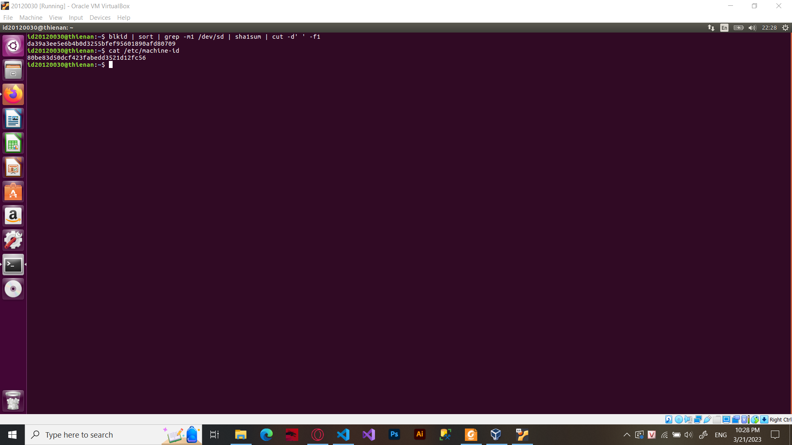<br/>
  Id of the first block to proof this is a personal computer.
</p>

<p align="center">
  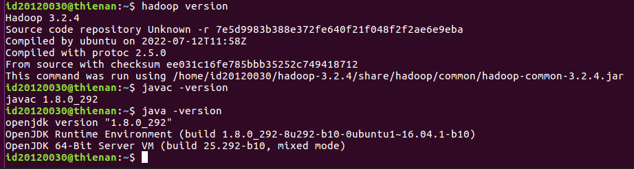<br/>
  Install Java and Hadoop then setup the environment path
</p>

<p align="center">
  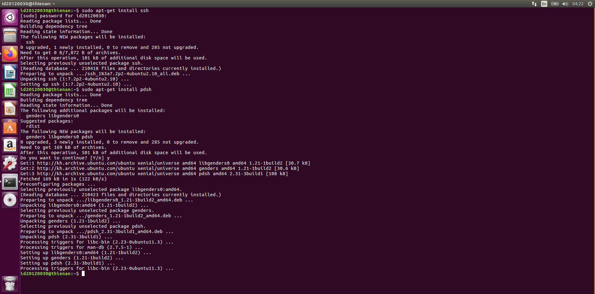<br/>
  Install ssh and pdsh
</p>

<p align="center">
  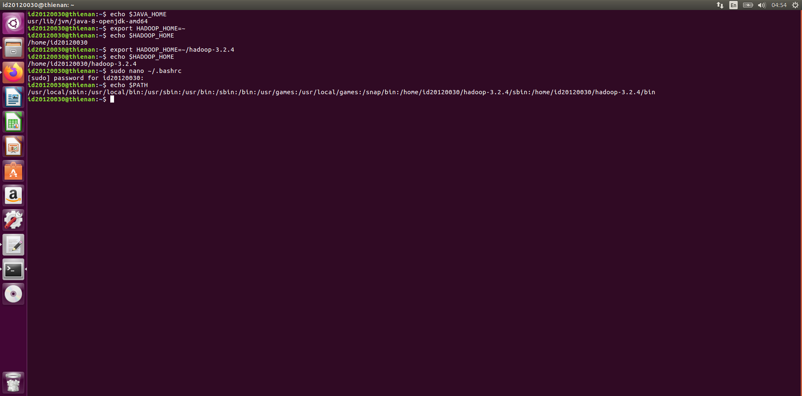<br/>
  JAVA_HOME and HADOOP_HOME
</p>

<p align="center">
  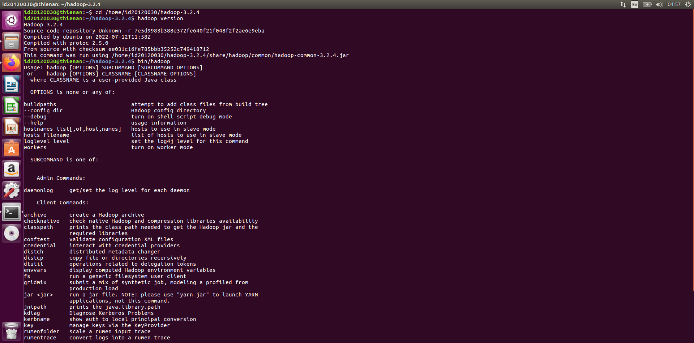<br/>
  Show hadoop version and bin/hadoop
</p>

<p align="center">
  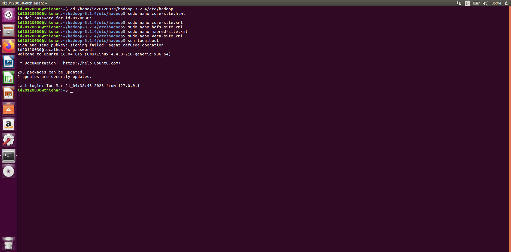<br/>
  Make changes on core-site.xml, hdfs-site.xml, mapred-site.xml, yarn-site.xml
</p>

<p align="center">
  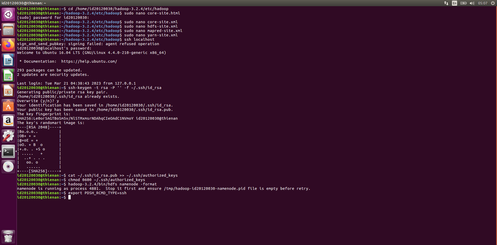<br/>
  ssh localhost
</p>

<p align="center">
  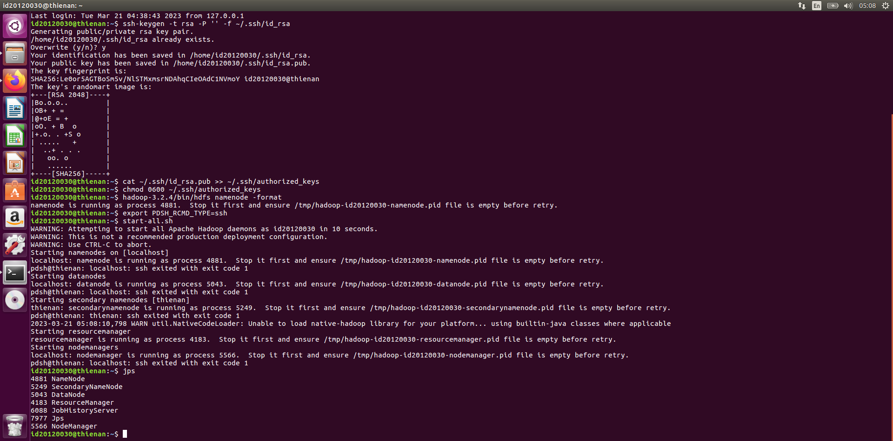<br/>
  Start all daemons hadoop
</p>

<p align="center">
  <br/>
  Create a folder named 20120030 in /user
</p>

<p align="center">
  <br/>
  Create folder 20120030 successfully!
</p>

<p align="center">
  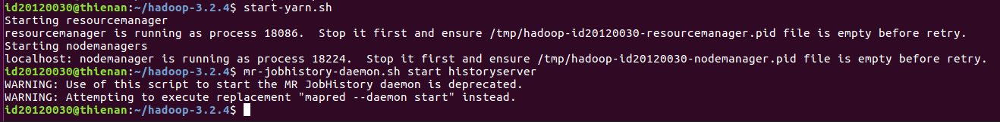<br/>
  Start yarn and historyserver
</p>

<p align="center">
  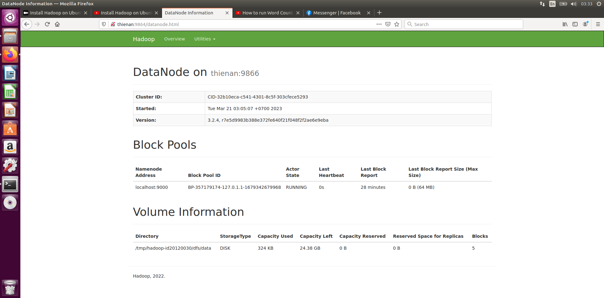<br/>
  DataNode
</p>

<p align="center">
  <br/>
  MapReduce Server
</p>

<p align="center">
  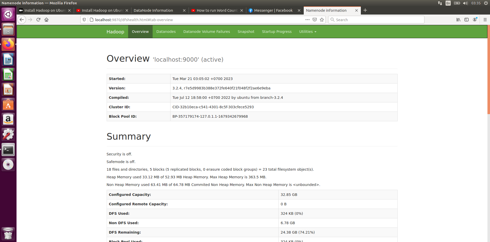<br/>
  NameNode
</p>

<p align="center">
  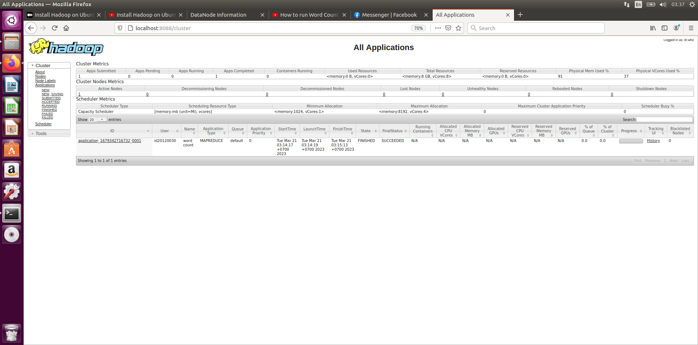<br/>
  YarnNode
</p>

<p align="center">
  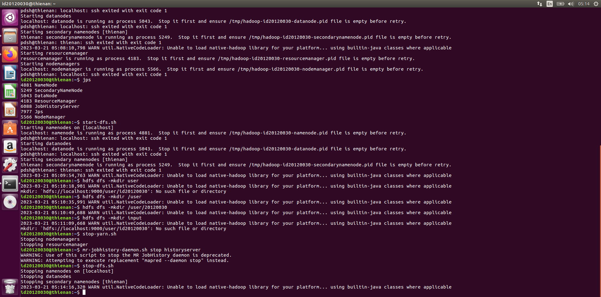<br/>
  Stop all daemons hadoop
</p>

### 📌 **Member 4:** 20120165 - Hong Nhat Phuong:

<p align="center">
  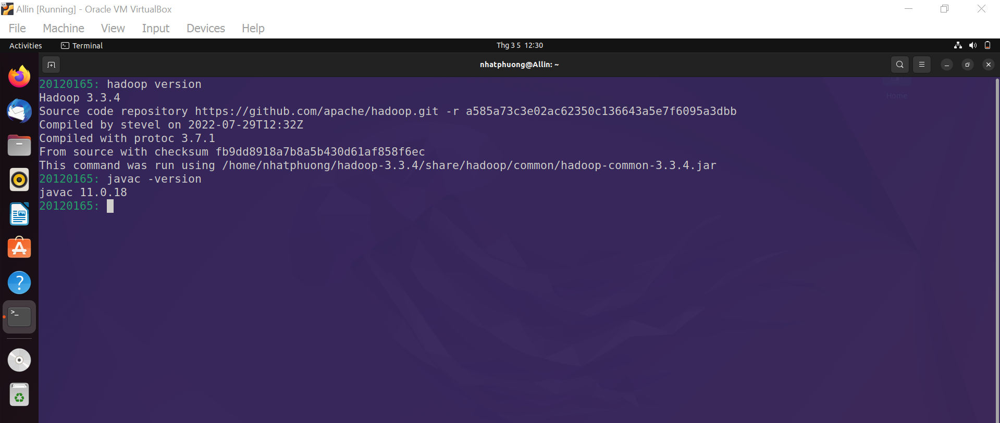<br/>
  Install Java and Hadoop then setup the environment path
</p>

<p align="center">
  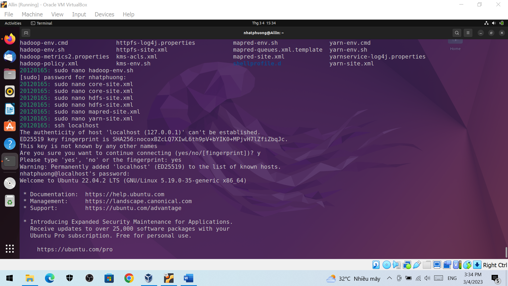<br/>
  Make changes on core-site.xml, hdfs-site.xml, mapred-site.xml, yarn-site.xml
</p>

<p align="center">
  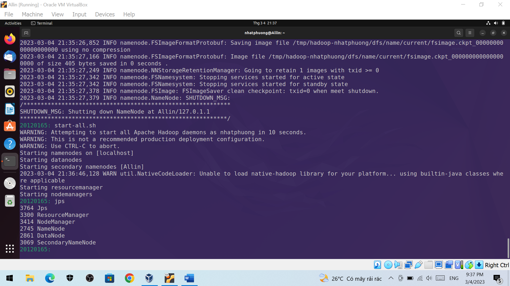<br/>
  Format namenode and start all daemons hadoop
</p>

## 📂 **2. Introduction to MapReduce**

<h5 style = "background-color:#37275a; padding: 1em; font-style: italic; "> 📌 1. How do the input keys-values, the intermediate keys-values, and the output keys-values relate? </h5>

<p align="justify">
The input keys-values are the data sets that are processed by the Map function. The input data is divided into key-value pairs that are distributed across the nodes in the Hadoop cluster. The Map function processes each key-value pair and produces an intermediate key-value pair.

The intermediate keys-values are produced by the Map function and are used as input to the Reduce function. The intermediate key-value pairs are sorted by key and partitioned based on the key. Each partition is processed by a separate instance of the Reduce function.

The output keys-values are the final result of the MapReduce process. The Reduce function produces the final key-value pairs which are written to the Hadoop Distributed File System (HDFS) or to an external storage system.
</p>

<h5 style = "background-color:#37275a; padding: 1em; font-style: italic; "> 📌 2. How does MapReduce deal with node failures? </h5>

<p align="justify">
When the compute node at which the master is executing fails, a new copy can be started from the last checkpointed state. Only this one node can bring the entire process down; other node failures will be managed by the master.

The master sends heartbeat to every worker periodically. If there is no response from the worker within a certain period of time, the master marks the worker as failed. Map tasks that were assigned by that worker will be reset to their original idle state and eligible for scheduling by other workers, even if they have completed. Completed map tasks are re-executed because their output is stored at that compute node, and is now unavailable to access.

Similarly, reduce task in progress on the failed worker is also reset to idle and will have to be redone. Completed reduce tasks do not need to be re-executed since their output is stored in a global file system. When a map task is executed first by a worker and then later executed by another worker (because the first one failed), all workers executing reduce tasks are notified of the re-execution.
</p>

<h5 style = "background-color:#37275a; padding: 1em; font-style: italic; "> 📌 3. What is the meaning and implication of locality? What does it use? </h5>

Locality means that taking advantage of the fact that the input data is stored on the local disks of the machine that make up the clusters. As a result, the network bandwidth is conserved, and when running large MapReduce operations on a large cluster, most input is read locally, consume no network bandwidth, speed processes up significantly.

Each file is divided into same size blocks (default 64 MB), then each block is created multiple copies (typically 3 copies). These blocks are stored on different machine, but highly optimised location (maybe 2 copies in the same rack, and 1 copy in the other rack in case of failing). MapReduce master take the location of the input files and above blocks into account and attempts to schedule a map task on a machine that contains a replica of the corresponding input data. If that is impossible, it trys to schedule map tasks near a replica of that task's input data (maybe on the same rack). Locality is also the result of Rack awareness of Hadoop system.

<h5 style = "background-color:#37275a; padding: 1em; font-style: italic; "> 📌 4. Which problem is addressed by introducing a combiner function to the MapReduce model? </h5>

The combiner function introduced to the MapReduce model addresses the problem of **network congestion** and **data transfer**. In detail, When data is processed by the Map function, it generates a large number of key-value pairs, which are then sorted and shuffled before being sent to the Reduce function. This sorting and shuffling process can generate a significant amount of network traffic, especially if there are many duplicate keys. The combiner function is introduced after the Map phase and before the Shuffle and Sort phase. Its purpose is to aggregate the output of the Map function for each key, reducing the amount of data that needs to be transferred across the network. This can greatly reduce network congestion and improve the overall performance and scalability of the MapReduce job. Hence, the combiner function reduces network traffic, which is the main problem addressed by its introduction to the MapReduce model.

## 📂 **3. Running a warm-up problem: Word Count**

Each member has completed running the WordCount (v.1) program - a simple MapReduce program - on a Single node cluster on their local machine, as described in supplied tutorial. Also, this process is captured in screenshots.

### 📌 **Member 1:** 20120011 - Nguyen Hoang Huy

<p align="center">
  <br/>
  Create input and output directory in hadoop fs
</p>

<p align="center">
  <br/>
  Put file01.txt and file02.txt into input directory
</p>

<p align="center">
  <br/>
  Run WordCount program
</p>

<p align="center">
  <br/>
  Let's show the result
</p>

### 📌 **Member 2:** 20120030 - Nguyen Thien An

<p align="center">
  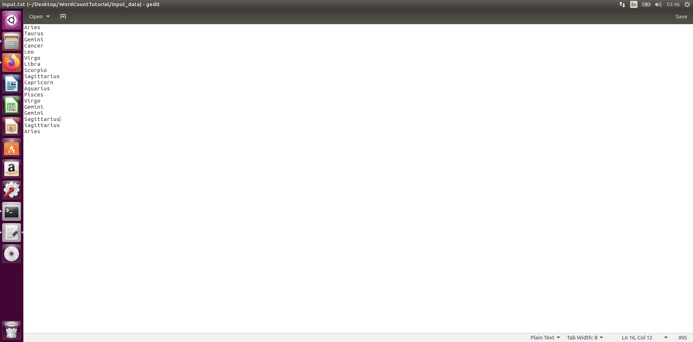<br/>
  File "input.txt"
</p>

<p align="center">
  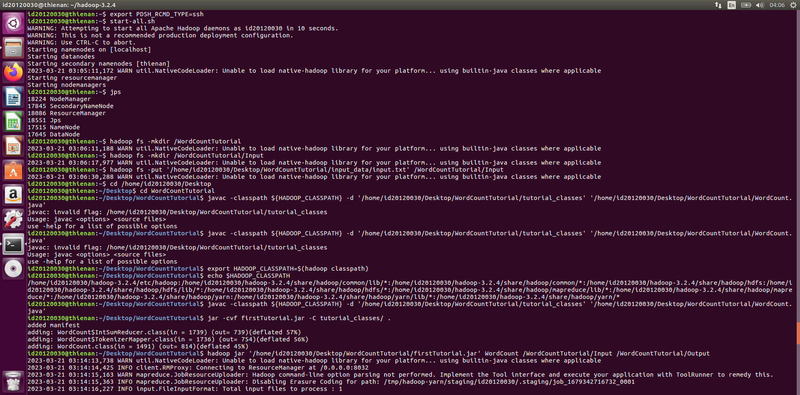<br/>
  Create folder input and put input.txt into input directory
</p>

<p align="center">
  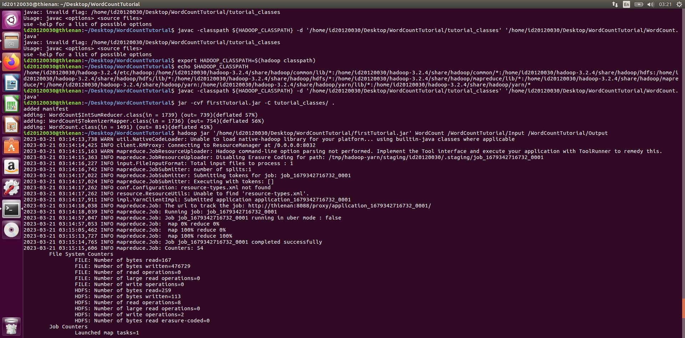<br/>
  Compile WordCount.java, create a jar and run WordCount program
</p>

<p align="center">
  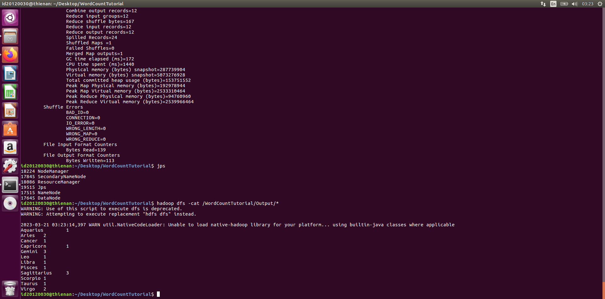<br/>
  Show the output using -cat command
</p>

<p align="center">
  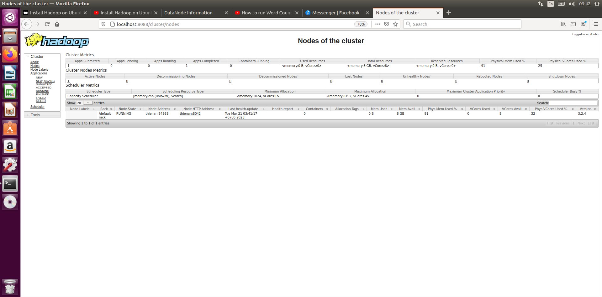<br/>
  Nodes of the cluster
</p>

<p align="center">
  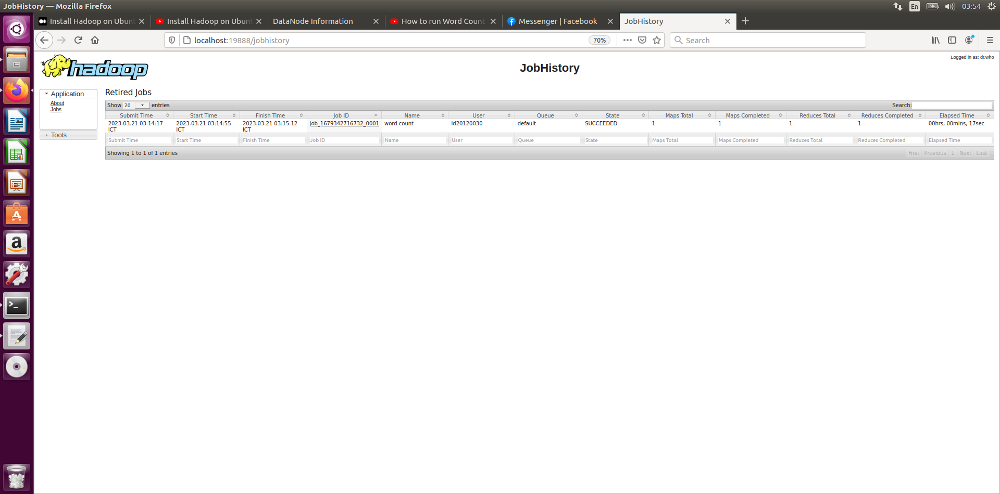<br/>
  MapReduce Server
</p>

### 📌 **Member 4:** 20120165 - Hong Nhat Phuong

<p align="center">
  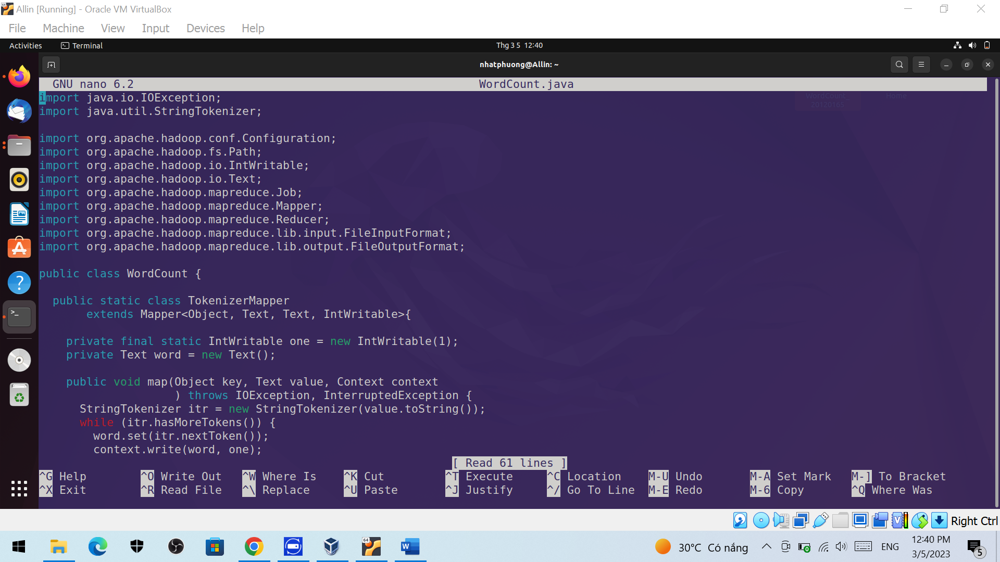<br/>
  Create WordCount.java
</p>

<p align="center">
  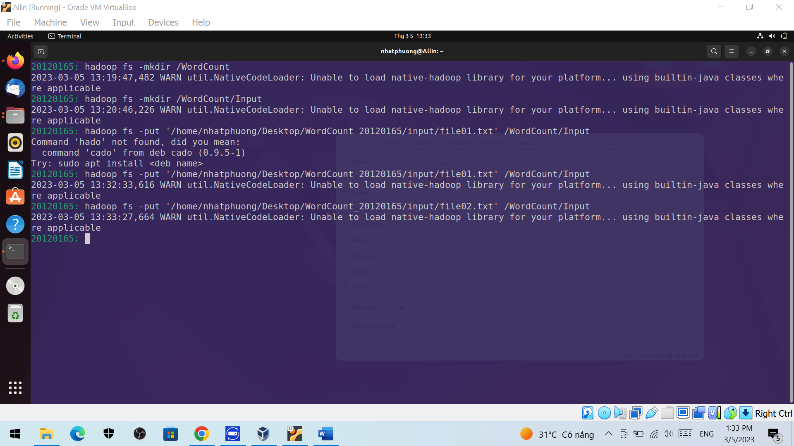<br/>
  Create folder input and put file01.txt, file02.txt into input directory
</p>

<p align="center">
  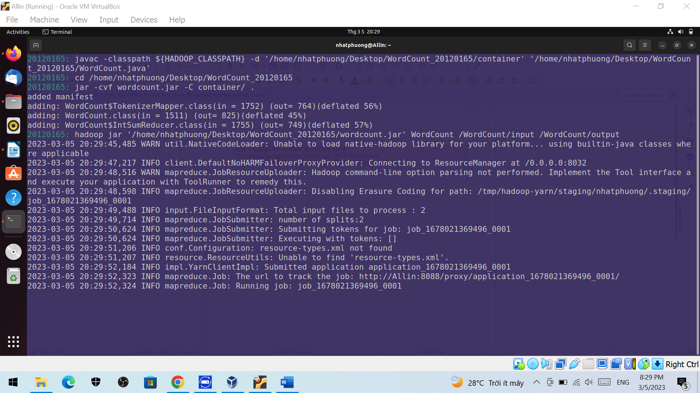<br/>
  Compile WordCount.java, create a jar and run WordCount program
</p>

<p align="center">
  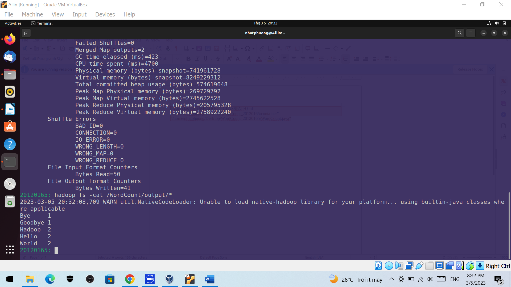<br/>
  Show the output using -cat command
</p>

## 📂 **4. Bonus**

Insert table example:

Server IP Address | Ports Open
------------------|----------------------------------------
192.168.1.1       | **TCP**: 21,22,25,80,443
192.168.1.2       | **TCP**: 22,55,90,8080,80
192.168.1.3       | **TCP**: 1433,3389\
**UDP**: 1434,161

Code example:

```python
print("Hello")
```

```bash
cat ~/.bashrc
```

Screenshot example:


\newpage

Screenshot example:


Reference examples:

Some text in which I cite an author.[^fn1]

More text. Another citation.[^fn2]

What is this? Yet _another_ citation?[^fn3]

## References
<!-- References without citing, this will be display as resources -->
- Three Cloudera version of WordCount problem:
  - <https://docs.cloudera.com/documentation/other/tutorial/CDH5/topics-/ht_wordcount1.html>
    - <https://docs.cloudera.com/documentation/other/tutorial/CDH5/topics/ht_wordcount2.html>
    - <https://docs.cloudera.com/documentation/other/tutorial/CDH5/topics/ht_wordcount3.html>
- Book: MapReduce Design Patterns [Donald Miner, Adam Shook, 2012]
- All of StackOverflow link related.

<!-- References with citing, this will be display as footnotes -->
[^fn1]: So Chris Krycho, "Not Exactly a Millennium," chriskrycho.com, July 2015, http://v4.chriskrycho.com/2015/not-exactly-a-millennium.html
(accessed July 25, 2015)

[^fn2]: Contra Krycho, 15, who has everything _quite_ wrong.

[^fn3]: ibid
