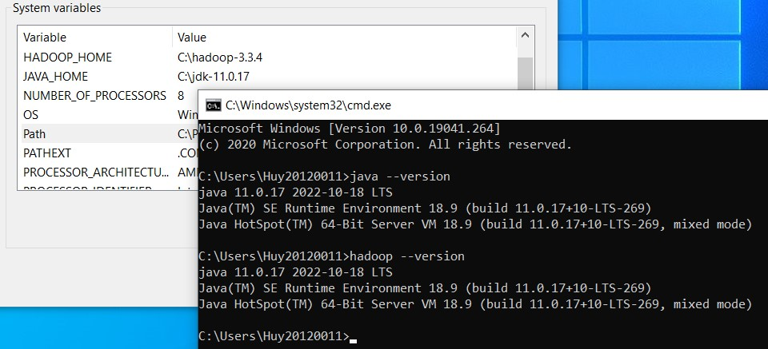
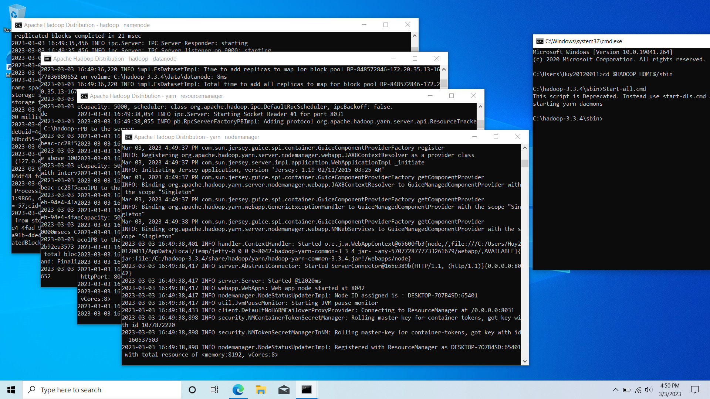
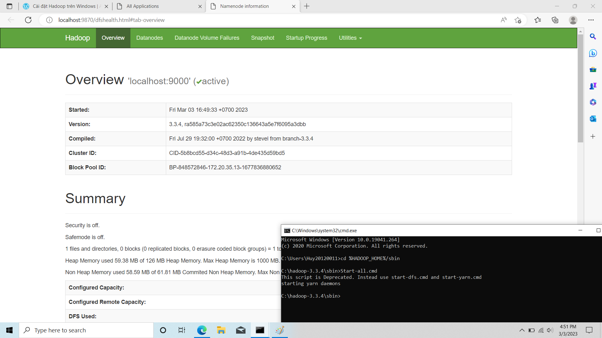
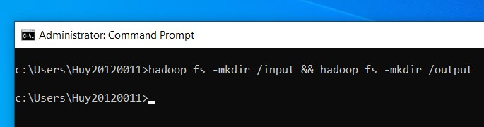
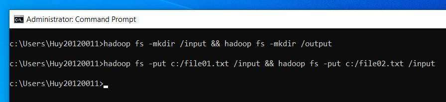
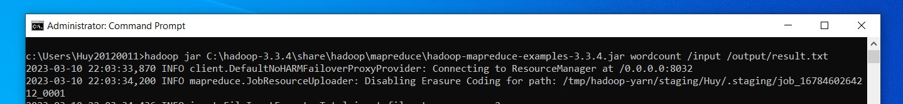
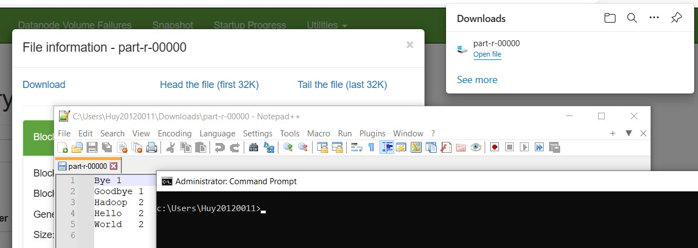

# Lab 01: A Gentle Introduction to Hadoop

## Setting up Single-node Hadoop Cluster

Each member has completed setting up a Single node cluster on their local machine, as described in supplied tutorial. Also, this process is captured in screenshots.

### Member 20120011 - Nguyen Hoang Huy:

<p align="center">
  <br/>
  Install Java and Hadoop then setup the environment path
</p>

<p align="center">
  <br/>
  Run start-all.cmd to start namenode, datanode, resourcemanager, nodemanager program
</p>

<p align="center">
  <br/>
  Access localhost:9000
</p>

## Introduction to MapReduce
##### 1. How do the input keys-values, the intermediate keys-values, and the output keys-values relate?

<p align="justify">
The input keys-values are the data sets that are processed by the Map function. The input data is divided into key-value pairs that are distributed across the nodes in the Hadoop cluster. The Map function processes each key-value pair and produces an intermediate key-value pair.

The intermediate keys-values are produced by the Map function and are used as input to the Reduce function. The intermediate key-value pairs are sorted by key and partitioned based on the key. Each partition is processed by a separate instance of the Reduce function.

The output keys-values are the final result of the MapReduce process. The Reduce function produces the final key-value pairs which are written to the Hadoop Distributed File System (HDFS) or to an external storage system.
</p>

##### 2. How does MapReduce deal with node failures?

## Running a warm-up problem: Word Count

Each member has completed running the WordCount (v.1) program - a simple MapReduce program - on a Single node cluster on their local machine, as described in supplied tutorial. Also, this process is captured in screenshots.

### Member 20120011 - Nguyen Hoang Huy

<p align="center">
  <br/>
  Create input and output directory in hadoop fs
</p>

<p align="center">
  <br/>
  Put file01.txt and file02.txt into input directory
</p>

<p align="center">
  <br/>
  Run WordCount program
</p>

<p align="center">
  <br/>
  Let's show the result
</p>

## Bonus

Insert table example:

Server IP Address | Ports Open
------------------|----------------------------------------
192.168.1.1       | **TCP**: 21,22,25,80,443
192.168.1.2       | **TCP**: 22,55,90,8080,80
192.168.1.3       | **TCP**: 1433,3389\
**UDP**: 1434,161

Code example:

```python
print("Hello")
```

```bash
cat ~/.bashrc
```

Screenshot example:


\newpage

Screenshot example:


Reference examples:

Some text in which I cite an author.[^fn1]

More text. Another citation.[^fn2]

What is this? Yet _another_ citation?[^fn3]

## References
<!-- References without citing, this will be display as resources -->
- Three Cloudera version of WordCount problem:
  - <https://docs.cloudera.com/documentation/other/tutorial/CDH5/topics-/ht_wordcount1.html>
    - <https://docs.cloudera.com/documentation/other/tutorial/CDH5/topics/ht_wordcount2.html>
    - <https://docs.cloudera.com/documentation/other/tutorial/CDH5/topics/ht_wordcount3.html>
- Book: MapReduce Design Patterns [Donald Miner, Adam Shook, 2012]
- All of StackOverflow link related.

<!-- References with citing, this will be display as footnotes -->
[^fn1]: So Chris Krycho, "Not Exactly a Millennium," chriskrycho.com, July 2015, http://v4.chriskrycho.com/2015/not-exactly-a-millennium.html
(accessed July 25, 2015)

[^fn2]: Contra Krycho, 15, who has everything _quite_ wrong.

[^fn3]: ibid
