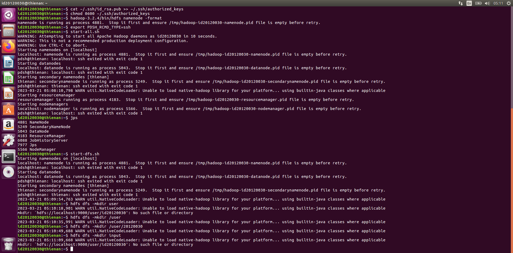
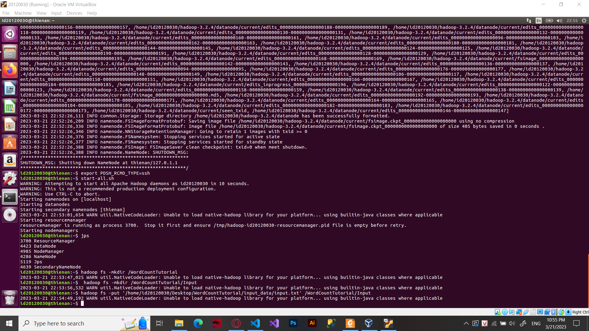

<!-- ---
title: "Lab 01: A Gentle Introduction to Hadoop"
author: ["your-team-name"]
date: "2023-02-17"
subtitle: "CSC14118 Introduction to Big Data 20KHMT1"
lang: "en"
titlepage: true
titlepage-color: "0B1887"
titlepage-text-color: "FFFFFF"
titlepage-rule-color: "FFFFFF"
titlepage-rule-height: 2
book: true
classoption: oneside
code-block-font-size: \scriptsize
--- -->

<h1 style="background-color:#37275a; font-weight: 500; color:white; line-height: 3em; padding-left: 1em; font-size: 50px;">Lab 01: A Gentle Introduction to Hadoop</h1>

- Author: [All in] group

- Date: 21/03/2023

- Subtitle: CSC14118 Introduction to Big Data 20KHMT1

- Language: English

## 📂 **1. Setting up Single-node Hadoop Cluster**

Each member has completed setting up a Single node cluster on their local machine, as described in supplied tutorial. Also, this process is captured in screenshots.

### 📌 **Member 1:** 20120090 - Nguyen The Hoang

> This member will present detail of the steps setting up Single-node Hadoop cluster. Other members will only show result in their machines. Some steps or result may be different between machines of each member, due to some difference of software/hardware environment and tutorials that they followed. But without loss of generality, the main steps are same.
>
> This Single-node Hadoop Cluster is installed in the Linux OS, Mint distro.

   
  Step 1: Make sure that a suitable version of Java installed

   
  Step 2: Download and extracted the Hadoop packaged file from the Apache Hadoop releases page

   
  Step 3: Set up the environment variable <code>JAVA_HOME</code> in the file <i>etc/environment</i> which points to the binary folder of Java, so that Hadoop can use Java when compiling MapReduce programs and execute damemons/processes.

  
  Step 4: Set up the environment variable <code>HADOOP_HOME</code> in the file <i>~/.bashrc</i> (or by using <code>export</code> temporarily) which points to the extracted folder of Hadoop, so that it is more convenient to call Hadoop command after that.

  
  Step 5: Check that Hadoop runs by typing <code>hadoop version</code>

#### **Running in Local (Standalone Mode)**

 

  
  Step 6: Keep the default configure file of Hadoop. Conduct the Standalone Operation as instructed in [^1], the above picture shows the result in the <i>output</i> folder

#### **Running in Pseudo-Distributed Mode**

 

  Step 7: Change the configure files: <i>core-site.xml, hdfs-site.xml, mapred-site.xml, yarn-site.xml</i> as instructed in [^1] and [^2] to set up for Pseudo-Distributed Mode

  
  Step 8: Install <i>ssh</i>

  
  Step 9: Enable passwordless login by generating new SSH key with an empty passphrase

  
  Step 10: Formatting the HDFS filesystem <i>ssh</i>

  
  Step 11: Start NameNode daemon and DataNode daemon with <code>start-dfs.sh</code>

  
  Step 12: As instructed in [^1], make the HDFS directories required to execute MapReduce jobs; copy some local files into the distributed filesystem and run the MapReduce example provided

  
  Step 13: Copy the output files from the distributed filesystem to the local filesystem to examine them

#### **Running in Pseudo-Distributed Mode with YARN**

 

  
  Step 14: Start the ResourceManager daemon and NodeManager daemon by running <code>start-yarn.sh</code>. Optionally, start the history server by running <code>mr-jobhistory-daemon.sh start historyserver</code>

#### **Accessing the Web interfaces of running Hadoop process**

These are the results when start all main components of a Single-node Hadoop Cluster

  
  Web UI of NameNode through <code>http://localhost:9870/</code>

  
  Web UI of a DataNode

  
  Web UI of a ResourceManager through <code>http://localhost:8088/</code>

  
  Web UI of MapReduce history server <code>http://localhost:19888/</code>

### 📌 **Member 2:** 20120011 - Nguyen Hoang Huy

   
  Install Java and Hadoop then setup the environment path

   
  Run start-all.cmd to start namenode, datanode, resourcemanager, nodemanager program

   
  Access localhost:9000

### 📌 **Member 3:** 20120030 - Nguyen Thien An

   
  Id of the first block to proof this is a personal computer.

   
  Install Java and Hadoop then setup the environment path

   
  Install ssh and pdsh

   
  JAVA_HOME and HADOOP_HOME

   
  Show hadoop version and bin/hadoop

   
  Make changes on core-site.xml, hdfs-site.xml, mapred-site.xml, yarn-site.xml

   
  ssh localhost

   
  Start all daemons hadoop

   
  Create a folder named 20120030 in /user

   
  Create folder 20120030 successfully!

   
  Start yarn and historyserver

   
  DataNode

   
  MapReduce Server

   
  NameNode

   
  YarnNode

   
  Stop all daemons hadoop

### 📌 **Member 4:** 20120165 - Hong Nhat Phuong

   
  Install Java and Hadoop then setup the environment path

   
  Make changes on core-site.xml, hdfs-site.xml, mapred-site.xml, yarn-site.xml

   
  Format namenode and start all daemons hadoop

## 📂 **2. Introduction to MapReduce**

<h5 style = "background-color:#37275a; padding: 1em; font-style: italic; "> 📌 1. How do the input keys-values, the intermediate keys-values, and the output keys-values relate? </h5>

The input keys-values are the data sets that are processed by the Map function. The input data is divided into key-value pairs that are distributed across the nodes in the Hadoop cluster. The Map function processes each key-value pair and produces an intermediate key-value pair.

The intermediate keys-values are produced by the Map function and are used as input to the Reduce function. The intermediate key-value pairs are sorted by key and partitioned based on the key. Each partition is processed by a separate instance of the Reduce function.

The output keys-values are the final result of the MapReduce process. The Reduce function produces the final key-value pairs which are written to the Hadoop Distributed File System (HDFS) or to an external storage system.

<h5 style = "background-color:#37275a; padding: 1em; font-style: italic; "> 📌 2. How does MapReduce deal with node failures? </h5>

When the compute node at which the master is executing fails, a new copy can be started from the last checkpointed state. Only this one node can bring the entire process down; other node failures will be managed by the master.

The master sends heartbeat to every worker periodically. If there is no response from the worker within a certain period of time, the master marks the worker as failed. Map tasks that were assigned by that worker will be reset to their original idle state and eligible for scheduling by other workers, even if they have completed. Completed map tasks are re-executed because their output is stored at that compute node, and is now unavailable to access.

Similarly, reduce task in progress on the failed worker is also reset to idle and will have to be redone. Completed reduce tasks do not need to be re-executed since their output is stored in a global file system. When a map task is executed first by a worker and then later executed by another worker (because the first one failed), all workers executing reduce tasks are notified of the re-execution.

<h5 style = "background-color:#37275a; padding: 1em; font-style: italic; "> 📌 3. What is the meaning and implication of locality? What does it use? </h5>

Locality means that taking advantage of the fact that the input data is stored on the local disks of the machine that make up the clusters. As a result, the network bandwidth is conserved, and when running large MapReduce operations on a large cluster, most input is read locally, consume no network bandwidth, speed processes up significantly.

Each file is divided into same size blocks (default 64 MB), then each block is created multiple copies (typically 3 copies). These blocks are stored on different machine, but highly optimised location (maybe 2 copies in the same rack, and 1 copy in the other rack in case of failing). MapReduce master take the location of the input files and above blocks into account and attempts to schedule a map task on a machine that contains a replica of the corresponding input data. If that is impossible, it trys to schedule map tasks near a replica of that task's input data (maybe on the same rack). Locality is also the result of Rack awareness of Hadoop system.

<h5 style = "background-color:#37275a; padding: 1em; font-style: italic; "> 📌 4. Which problem is addressed by introducing a combiner function to the MapReduce model? </h5>

The combiner function introduced to the MapReduce model addresses the problem of **network congestion** and **data transfer**. In detail, When data is processed by the Map function, it generates a large number of key-value pairs, which are then sorted and shuffled before being sent to the Reduce function. This sorting and shuffling process can generate a significant amount of network traffic, especially if there are many duplicate keys. The combiner function is introduced after the Map phase and before the Shuffle and Sort phase. Its purpose is to aggregate the output of the Map function for each key, reducing the amount of data that needs to be transferred across the network. This can greatly reduce network congestion and improve the overall performance and scalability of the MapReduce job. Hence, the combiner function reduces network traffic, which is the main problem addressed by its introduction to the MapReduce model.

## 📂 **3. Running a warm-up problem: Word Count**

Each member has completed running the WordCount (v.1) program - a simple MapReduce program - on a Single node cluster on their local machine, as described in supplied tutorial. Also, this process is captured in screenshots.

### 📌 **Member 1:** 20120011 - Nguyen Hoang Huy

   
  Create input and output directory in hadoop fs

   
  Put file01.txt and file02.txt into input directory

   
  Run WordCount program

   
  Let's show the result

### 📌 **Member 2:** 20120030 - Nguyen Thien An

   
  File "input.txt"

   
  Create folder input and put input.txt into input directory

   
  Compile WordCount.java, create a jar and run WordCount program

   
  Show the output using -cat command

   
  Nodes of the cluster

   
  MapReduce Server

### 📌 **Member 3:** 20120090 - Nguyen The Hoang

  
  Step 1: Create the WordCount v1.0 file as instructed in [^3]. Compile this file to the <i>class</i> and <i>jar</i> file</code>

  
  Step 2: Start the Hadoop on the Pseudo-distributed Mode

  
  
  Step 3: As instructed in [^3], create two input files in the distributed filesystem, in the <i>input</i> folder

  
  Step 4: Run the MapReduce program

  
  
  
  Result (from top to bottom picture): 1. The submited jobs show in the Resource Manager YARN 2. The DataNode is doing its assigned task 3. The result is recored in the <i>output</i> folder, pulled to the local filesystem to print in the terminal

### 📌 **Member 4:** 20120165 - Hong Nhat Phuong

   
  Create WordCount.java

   
  Create folder input and put file01.txt, file02.txt into input directory

   
  Compile WordCount.java, create a jar and run WordCount program

   
  Show the output using -cat command

## 📂 **4. Bonus**

### **4.1. Bad Relationship**

[^1]: Apache Hadoop, “Hadoop: Setting up a Single Node Cluster,” Jul. 29, 2022. https://hadoop.apache.org/docs/stable/hadoop-project-dist/hadoop-common/SingleCluster.html.

[^2] T. White, “Appendix A. Installing Apache Hadoop,” in Hadoop: The definite guide, 2012, p. 680.

[^3] Apache Hadoop, “MapReduce Tutorial,” Jul. 29, 2022. https://hadoop.apache.org/docs/stable/hadoop-mapreduce-client/hadoop-mapreduce-client-core/MapReduceTutorial.html.
