- Author: [All in] group

- Date: 11/04/2023

- Subtitle: CSC14118 Introduction to Big Data 20KHMT1

- Language: English

## **Task progression** {-}

| No. of task | % completed |
|-------------|-------------|
| 1 - 9       | 100%        |
| 10          | 0%   		|

## Problem 2: Word Size Word Count

**Input**: a text file name "alphabets" contains a large amount of words from a book.

**Output**: list of word size and the number of occurences for each word size. In short, how many words has size $x$, for $x = 1, \ldots, \inf$

**Idea**: this is just some derivation from trivial Word Count program. But here for each word in the text, we have to count the lenght of that word. The key is the word size, and the value is 1 for each word has that size. Using MapReduce mechanism, we then merge the result of each word size to get the final result.

**Code**:

***Mapper*** The map implementation is `WordSizeWordCountMapper()`. It receives each line of the text, as type `Text`. After that it emits a pair, with key is an integer show the word size - type `IntWritable` - and value is `1`. It means that, the map function seperate words by whitespace, then for each word, it counts the number of letters in that word. At the end, it just found 1 word has some specific size, and it emits them a pair key-value described above.

But the word can have some special character as a result of sentence or paragraph. Example `you.`, `ha!`, `so,` have `.`, `!` and `,` attached ti them, but normally, that can not be counted as some valid letter forms a word. To solve this problem in the map function, for each word we only keep `a-zA-Z_` letter and remove all others before we find the size of a word by using Regex [^1].

```java
word.set( itr.nextToken().replaceAll("[^\\w]", "") );
```

***Reducer*** The reduce implementation is `WordSizeWordCountReducer()`. It receives a pair <`size_of_word`, [`list_of_1`]> from the map functions. It means it takes one word size and list of 1s respect to how many words have that size. Now the reduce function only need to traverse the list of values and aggregate them. Finally, for each word size, the reduce emits a pair, with key is word size, and with value is the number of occurences, with type `<IntWritable, IntWritable>`.

```java
int sum = 0;
for (IntWritable val : values) {
    sum += val.get();
}
result.set(sum);
```

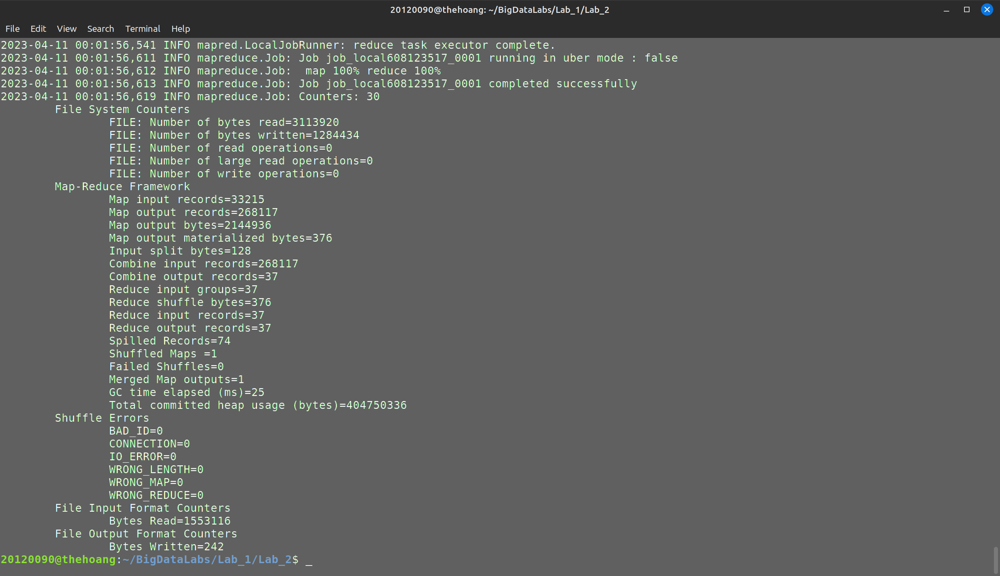
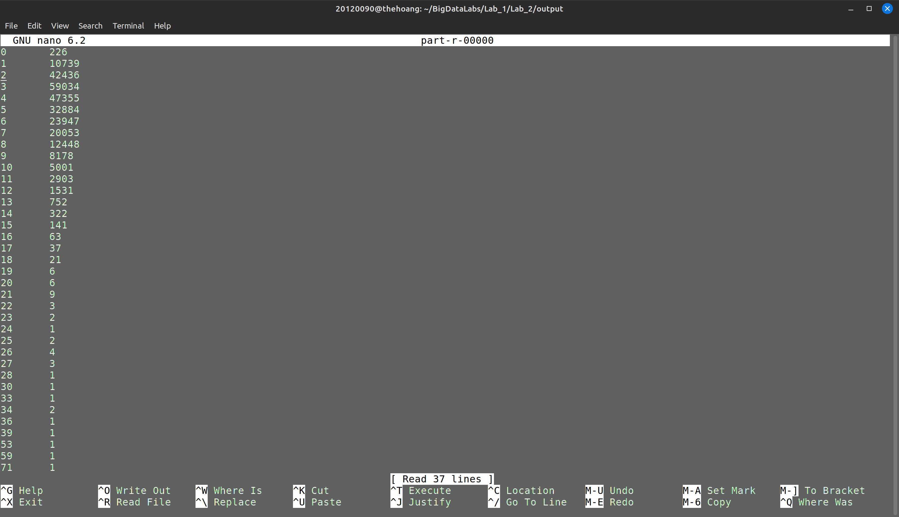

## Problem 3: Weather Data

**Input**: data list including date, minimum temperature, maximum temperature and other information

**Output**: print "hot day" for days with the highest temperature greater than 40 degrees, and "cold days" for days with the lowest temperature less than 10 degrees.

**Idea**: extract information like date, minimum temperature, maximum temperature. Check for the day has the highest temperature > 40 degrees, the lowest temperature < 10 degrees, then save the date information.

**Code**:

***Mapper***
*map() function*

- Use the substring() command to get the date and temperature information
- Convert the temperature from string to real number, check the min and max temperature according to the problem requirements and write the result to the context variable.
- Use 2 if functions to check in case a day has minimum temperature less than 10 and maximum temperature greater than 40.

```java
Text date = new Text();
Text word = new Text();

String line = value.toString();
String d = line.substring(14, 22);
float max = Float.parseFloat(line.substring(104, 108).trim());
float min = Float.parseFloat(line.substring(112, 116).trim());
      
if (max > 40.0) {
    date.set(d);
    word.set("Hot day");
    context.write(date, word);
}
      
if (min < 10.0) {
    date.set(d);
    word.set("Cold day");
    context.write(date, word);
}
```

***Reducer***
*reduce() function*

- Record the output results, if there is a case in the same day that the lowest and highest temperatures are satisfied, then combine "cold day" and "hot day" into 1 result

```java
Text result = new Text();
String res = "";
for (Text val : values) {
    res = res + val + " ";
}
result.set(res);
context.write(key, result);
```

**Run program**

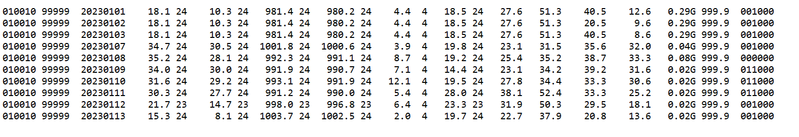
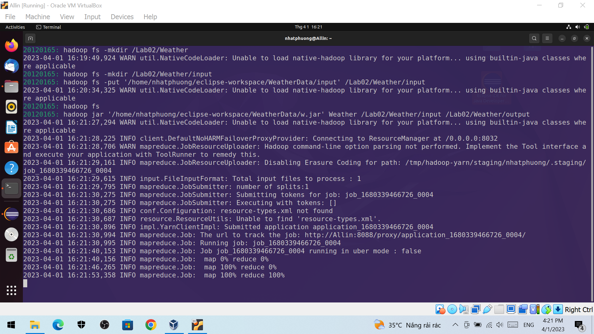
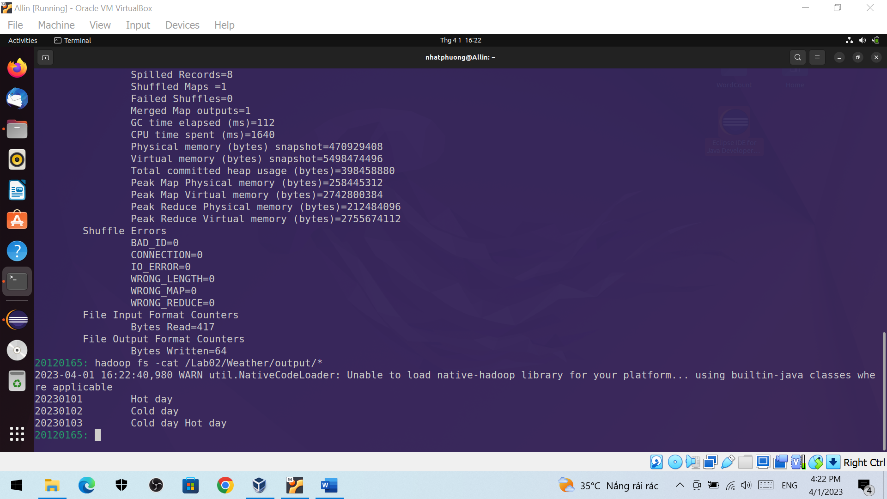

## Problem 4: Patent Program

**Input**: Each patent has sub-patent ids associated with it.

**Output**: The number of sub-patent associated with each patent.

**Idea**: Just look like WordCount program.

***Map***: Split lines, get 2 tokens and write them to context.

```java
public void map(LongWritable key, Text value, Context context) throws IOException, InterruptedException {
			String line = value.toString();
			StringTokenizer tokenizer = new StringTokenizer(line, " ");
			while (tokenizer.hasMoreTokens()) {
				String pat = tokenizer.nextToken();
				k.set(pat);
				String sub = tokenizer.nextToken();
				v.set(sub);
				context.write(k, v);
			}
		}
```

***Reduce***: Count the number of sub-patent associated with each patent.

```java
public void reduce(Text key, Iterable<Text> values, Context context) throws IOException, InterruptedException {
			int sum = 0;
			for (Text x : values) {
				sum++;
			}
			context.write(key, new IntWritable(sum));
		}
```

**Run**:

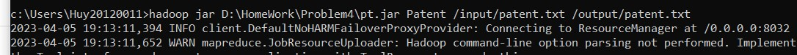

**Result**:

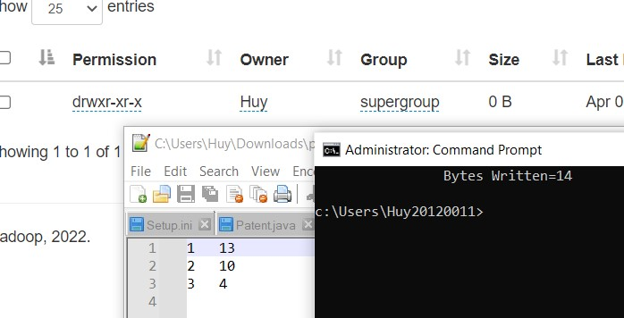

## Problem 6: Average Salary Program

**Input**: the input file is taken from [^2]. The file is written in `csv` format, with using `""` as escaped characted for `,` in case of long string. There are 13 fields. In 13 fields, there are 3 empty fields. Based on `id` field, there are 148654 distinct employeees. For this task, we take into account 2 fields: `JobTitle` and `TotalPayBenefits`. We will count for each distinct `JobTitle`, what is the average total pay benefits the employees in that job title can receive. Based on data, there are 2159 distinct `JobTitle`.

**Output**: for each `JobTitle`, employees in that field receive how much total pay benefits (salary) in average.

**Idea**: for each `JobTitle`, we only need to take all total pay benefits of all people working in that job title, and create a pair key-value. After that, for each `JobTitle`, we calculate the average values.

**Code**:

***Mapper*** The map implementation is `AverageSalaryMapper()`.  The map function takes each line as input with `Text` type. It then uses seperate the data as csv format by this statements, using Regex (we need to take care the case there is `,` in the job title, so we used Regex). [^3].

```java
String[] columns = valueStr.split(",(?=(?:[^\"]*\"[^\"]*\")*[^\"]*$)", -1);
```

The map function then just emit the pair `<Text, FloatWritable>` takes from sepetated data. The key is the `JobTitle` and the value is `TotalPayBenefits` of an employee. Here the value of salary is float number, so we use `FloatWritable` for that data.

But because the first line of file contains the header title of the data, we need to use `try...catch...` to preven the case the text are converted to float number.

```java
try {
	context.write( new Text(columns[2]), new FloatWritable(Float.parseFloat(columns[8])) );
} catch (Exception e) {
	return;
}
```

***Reducer*** The reduce implementation is `AverageSalaryReducer()`. It receives pairs <`JobTitle`, [`list_of_salary_values`]>. It means it takes a job title and list of salary values of all people working in that position. Here we only need to traverse the list of values, then add that value to the current computed average salary value. The detailed implemention is shown below:

```java
float average = 0;
int cnt = 0;

for (FloatWritable val : values) {
	++cnt;
	average = average + (val.get() - average)/cnt;
}
```

It emits the results as <`JobTitle`, `Average_value_computed_of_that_jobtitle`> as type <`Text`, `FloatWritable`>.

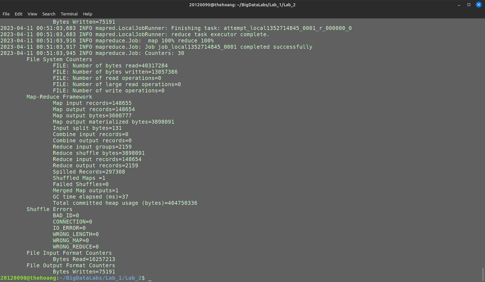
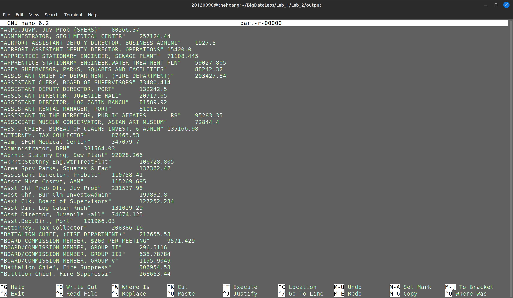

## Problem 7: DeIdentify Healthcare Program

**Input**: the input file is described in the given document [^4]. We only create the dataset includes 6 records, which are same as in the above document.

**Output**: we specify the fields we want to encrypt. Here we only keep the 1st, 7th and 9th fields. The others will be encrypted by the SHA-256 encryption algorithm. The final datas need to have the same format as original file.

**Idea**: we only use one map function to encrypt required fields. The results from this function will also be the final result. We need to choose the field for encryption carefully while keep other fields untouched. The whole idea is taken from [^4].

**Code**:

***Mapper*** The map implementation is `DeIdentifyHealthcareMapper`. The map function takes each line as `Text` type, seperate words by `,` deliminiter. There is no special things here, we check if current field need to be encrypted. If it is, we call `toHexString()` and `getSHA()` function to encrypt data as SHA-256 implementation.

We need to take care that, if we have not any result word yet, we must not add `,` to the result word to keep the original data format.

```java
if (newStr.length() > 0) newStr += ",";
...
if (newStr.length() > 0) newStr += ",";
```

The map function after encrypted a line of data will emit the pair result as <`null`, `encrypted_text`>. Here, we do not need any key so we set it `null`, the value is the encrypted text.

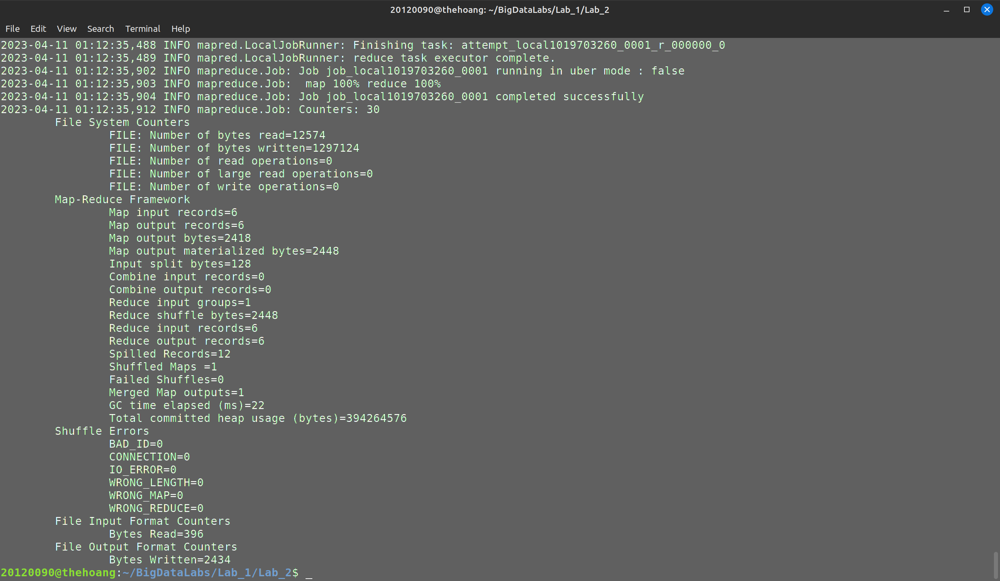
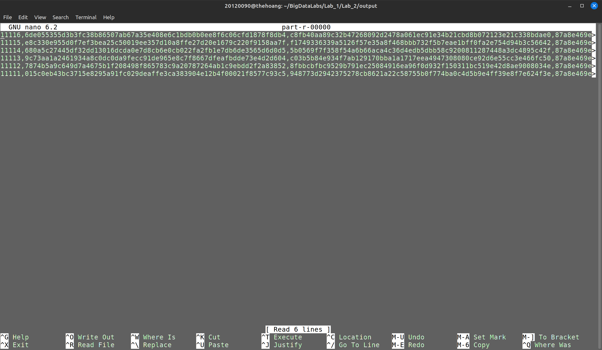

## Problem 8: Music Track Program

**Input**: UserId, TrackId, Shared, Radio, Skip

**Output**: TrackID, the number of unique users

**Idea**: I reference to the solution and github.

<https://gist.github.com/deshpandetanmay/70277a43dc9332819c93>

***Map***:

Split lines, if it is a valid record then write to context

```java
public static class UniqueListenerMapper extends
			Mapper<Object, Text, IntWritable, IntWritable> {

		IntWritable trackId = new IntWritable();
		IntWritable userId = new IntWritable();

		public void map(Object key, Text value,
				Mapper<Object, Text, IntWritable, IntWritable>.Context context)
				throws IOException, InterruptedException {

			String[] parts = value.toString().split("[|]");
			trackId.set(Integer.parseInt(parts[LastFMConstants.TRACK_ID]));
			userId.set(Integer.parseInt(parts[LastFMConstants.USER_ID]));

			if (parts.length == 5) {
				context.write(trackId, userId);
			} else {
				// add counter for invalid records
				context.getCounter(COUNTERS.INVALID_RECORD_COUNT).increment(1L);
			}

		}
	}
```

***Reduce***: Count the number of unique users

```java

	public static class UniqueListenerReducer extends
			Reducer<IntWritable, IntWritable, IntWritable, IntWritable> {

		public void reduce(
				IntWritable trackId,
				Iterable<IntWritable> userIds,
				Reducer<IntWritable, IntWritable, IntWritable, IntWritable>.Context context)
				throws IOException, InterruptedException {

			Set<Integer> userIdSet = new HashSet<Integer>();
			for (IntWritable userId : userIds) {
				userIdSet.add(userId.get());
			}
			IntWritable size = new IntWritable(userIdSet.size());
			context.write(trackId, size);
		}
	}
```

**Run**:

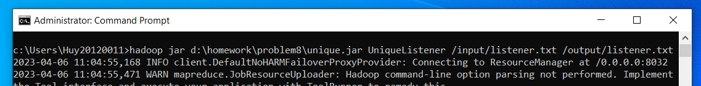

**Result**:

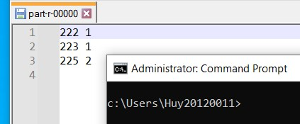

## Problem 9: Call Data Record

**Input**: list of data, each line includes caller phone number, recipient phone number, call start time, call end time, STD flag, each information separated by vertical bar ( | )
Consider following format
FromPhoneNumber|ToPhoneNumber|CallStartTime|CallEndTime|STDFlag

**Output**: all phone numbers who are making more than 60 minutes of STD calls.

**Idea**: extract caller phone number, call start and end time from data. Calculate the total call time of each phone number, save all the phone numbers have total time more than 60 minutes.

**Code**:
***Mapper***
*map() function*:

- Use split() command to cut string, save information into an array
- For the phone number has STD call, use get_time() function to get time in milliseconds of call start time and call end time, call time in millisec is saved to dur, in minutes is saved to duration
  
```java
Text phone_num = new Text();
LongWritable duration = new LongWritable();

String[] word = value.toString().split("[|]");

if (word[4].equalsIgnoreCase("1")) {
    phone_num.set(word[0]);
    String call_end = word[3];
    String call_start = word[2];
    long dur = get_time(call_end) - get_time(call_start);  //dur: time in millisecond
    duration.set(dur / (1000 * 60));    //duration: time in minute
    context.write(phone_num, duration);
}
```

*get_time() function:*
- Use SimpleDateFormat library to convert string data to Date data then use getTime() command to get time (in millisec)

```java
private long get_time(String str) {
    SimpleDateFormat formatter = new SimpleDateFormat("yyyy-MM-dd HH:mm:ss");
    Date date = null;
    try {
    	date = formatter.parse(str);
    } catch (ParseException e) {
    	e.printStackTrace();
    }
    return date.getTime();
}
```

*reducer() function:*
- Calculate the total call time of 1 phone number, if total time is more thanh 60 minutes, print the result.

```java
LongWritable result = new LongWritable();
long sum = 0;
for (LongWritable val : values) {
    sum += val.get();
}
result.set(sum);
if (sum >= 60) {
    context.write(key, result);
}
```

**Run program**

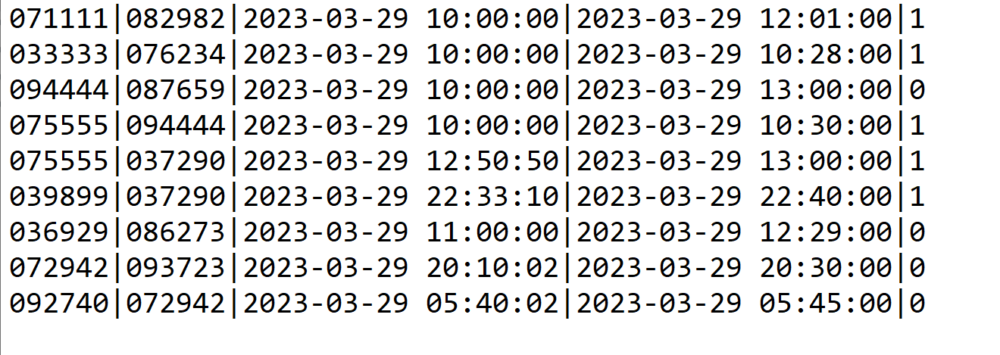
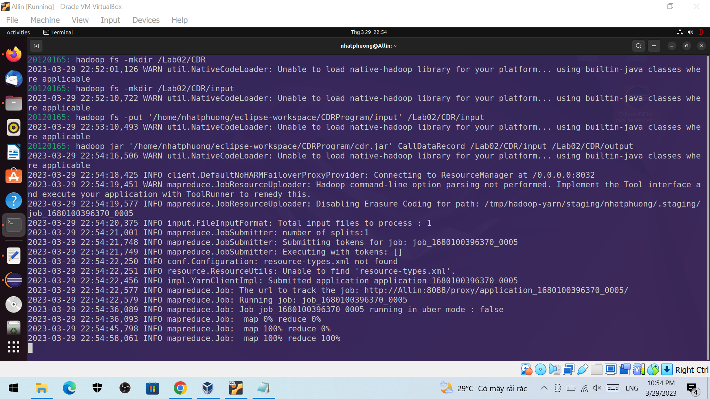
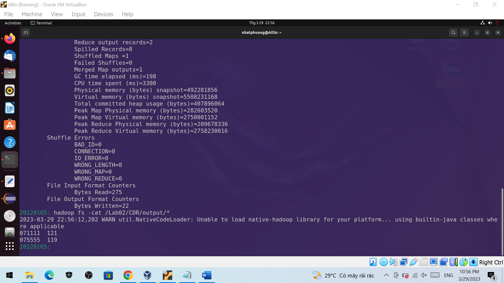

[^1]: A. Batkin, “Converting a sentence string to a string array of words in Java,” StackOverflow, 2014. https://stackoverflow.com/a/4674887/11985028.
[^2]: A. Batkin, “Converting a sentence string to a string array of words in Java,” StackOverflow, 2014. https://stackoverflow.com/a/4674887/11985028.
[^3]: Baeldung, “Ignoring Commas in Quotes When Splitting a Comma-separated String,” 2021. https://www.baeldung.com/java-split-string-commas.
[^4]: S. Balasubramanian, “Hadoop-MapReduce Lab.” p. 27, 2016.
