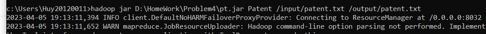
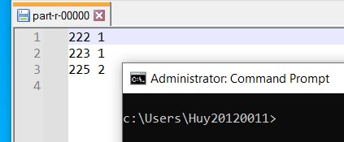

# Lab 02: MapReduce

#### Problem 3: Weather Data
**Input**: data list including date, minimum temperature, maximum temperature and other information

**Output**: print "hot day" for days with the highest temperature greater than 40 degrees, and "cold days" for days with the lowest temperature less than 10 degrees.

**Idea**: extract information like date, minimum temperature, maximum temperature. Check for the day has the highest temperature > 40 degrees, the lowest temperature < 10 degrees, then save the date information.

**Code**:
***Mapper***
*map() function*
- Use the substring() command to get the date and temperature information
- Convert the temperature from string to real number, check the min and max temperature according to the problem requirements and write the result to the context variable.
- Use 2 if functions to check in case a day has minimum temperature less than 10 and maximum temperature greater than 40.

```java
Text date = new Text();
Text word = new Text();

String line = value.toString();
String d = line.substring(14, 22);
float max = Float.parseFloat(line.substring(104, 108).trim());
float min = Float.parseFloat(line.substring(112, 116).trim());
      
if (max > 40.0) {
    date.set(d);
    word.set("Hot day");
    context.write(date, word);
}
      
if (min < 10.0) {
    date.set(d);
    word.set("Cold day");
    context.write(date, word);
}
```

***Reducer***
*reduce() function*
- Record the output results, if there is a case in the same day that the lowest and highest temperatures are satisfied, then combine "cold day" and "hot day" into 1 result

```java
Text result = new Text();
String res = "";
for (Text val : values) {
    res = res + val + " ";
}
result.set(res);
context.write(key, result);
```

**Run program**


#### Problem 4: Patent Program

**Input**: Each patent has sub-patent ids associated with it.

**Output**: The number of sub-patent associated with each patent.

**Idea**: Just look like WordCount program.

***Map***: Split lines, get 2 tokens and write them to context.

```java
public void map(LongWritable key, Text value, Context context) throws IOException, InterruptedException {
			String line = value.toString();
			StringTokenizer tokenizer = new StringTokenizer(line, " ");
			while (tokenizer.hasMoreTokens()) {
				String pat = tokenizer.nextToken();
				k.set(pat);
				String sub = tokenizer.nextToken();
				v.set(sub);
				context.write(k, v);
			}
		}
```
***Reduce***: Count the number of sub-patent associated with each patent.

```java
public void reduce(Text key, Iterable<Text> values, Context context) throws IOException, InterruptedException {
			int sum = 0;
			for (Text x : values) {
				sum++;
			}
			context.write(key, new IntWritable(sum));
		}
```

**Run**:



**Result**:


#### Problem 3: Call Data Record

**Input**: list of data, each line includes caller phone number, recipient phone number, call start time, call end time, STD flag, each information separated by vertical bar ( | )
Consider following format
FromPhoneNumber|ToPhoneNumber|CallStartTime|CallEndTime|STDFlag

**Output**: all phone numbers who are making more than 60 minutes of STD calls.

**Idea**: extract caller phone number, call start and end time from data. Calculate the total call time of each phone number, save all the phone numbers have total time more than 60 minutes.

**Code**:
***Mapper***
*map() function*:
- Use split() command to cut string, save information into an array
- For the phone number has STD call, use get_time() function to get time in milliseconds of call start time and call end time, call time in millisec is saved to dur, in minutes is saved to duration
  
```java
Text phone_num = new Text();
LongWritable duration = new LongWritable();

String[] word = value.toString().split("[|]");

if (word[4].equalsIgnoreCase("1")) {
    phone_num.set(word[0]);
    String call_end = word[3];
    String call_start = word[2];
    long dur = get_time(call_end) - get_time(call_start);  //dur: time in millisecond
    duration.set(dur / (1000 * 60));    //duration: time in minute
    context.write(phone_num, duration);
}
```

*get_time() function:*
- Use SimpleDateFormat library to convert string data to Date data then use getTime() command to get time (in millisec)

```java
private long get_time(String str) {
    SimpleDateFormat formatter = new SimpleDateFormat("yyyy-MM-dd HH:mm:ss");
    Date date = null;
    try {
    	date = formatter.parse(str);
    } catch (ParseException e) {
    	e.printStackTrace();
    }
    return date.getTime();
}
```

*reducer() function:*
- Calculate the total call time of 1 phone number, if total time is more thanh 60 minutes, print the result.

```java
LongWritable result = new LongWritable();
long sum = 0;
for (LongWritable val : values) {
    sum += val.get();
}
result.set(sum);
if (sum >= 60) {
    context.write(key, result);
}
```

**Run program**


#### Problem 8: Music Track Program

**Input**: UserId, TrackId, Shared, Radio, Skip

**Output**: TrackID, the number of unique users

**Idea**: I reference to the solution and github.

https://gist.github.com/deshpandetanmay/70277a43dc9332819c93

***Map***: 
Split lines, if it is a valid record then write to context
```java
public static class UniqueListenerMapper extends
			Mapper<Object, Text, IntWritable, IntWritable> {

		IntWritable trackId = new IntWritable();
		IntWritable userId = new IntWritable();

		public void map(Object key, Text value,
				Mapper<Object, Text, IntWritable, IntWritable>.Context context)
				throws IOException, InterruptedException {

			String[] parts = value.toString().split("[|]");
			trackId.set(Integer.parseInt(parts[LastFMConstants.TRACK_ID]));
			userId.set(Integer.parseInt(parts[LastFMConstants.USER_ID]));

			if (parts.length == 5) {
				context.write(trackId, userId);
			} else {
				// add counter for invalid records
				context.getCounter(COUNTERS.INVALID_RECORD_COUNT).increment(1L);
			}

		}
	}
```
***Reduce***: Count the number of unique users

```java

	public static class UniqueListenerReducer extends
			Reducer<IntWritable, IntWritable, IntWritable, IntWritable> {

		public void reduce(
				IntWritable trackId,
				Iterable<IntWritable> userIds,
				Reducer<IntWritable, IntWritable, IntWritable, IntWritable>.Context context)
				throws IOException, InterruptedException {

			Set<Integer> userIdSet = new HashSet<Integer>();
			for (IntWritable userId : userIds) {
				userIdSet.add(userId.get());
			}
			IntWritable size = new IntWritable(userIdSet.size());
			context.write(trackId, size);
		}
	}
```

**Run**:


**Result**:



Code example:

```python
print("Hello")
```

```bash
cat ~/.bashrc
```

Screenshot example:


\newpage

Screenshot example:


Reference examples:

Some text in which I cite an author.[^fn1]

More text. Another citation.[^fn2]

What is this? Yet _another_ citation?[^fn3]


## References
<!-- References without citing, this will be display as resources -->
- Three Cloudera version of WordCount problem:
    - https://docs.cloudera.com/documentation/other/tutorial/CDH5/topics-/ht_wordcount1.html
    - https://docs.cloudera.com/documentation/other/tutorial/CDH5/topics/ht_wordcount2.html
    - https://docs.cloudera.com/documentation/other/tutorial/CDH5/topics/ht_wordcount3.html
- Book: MapReduce Design Patterns [Donald Miner, Adam Shook, 2012]
- All of StackOverflow link related.

<!-- References with citing, this will be display as footnotes -->
[^fn1]: So Chris Krycho, "Not Exactly a Millennium," chriskrycho.com, July 2015, http://v4.chriskrycho.com/2015/not-exactly-a-millennium.html
(accessed July 25, 2015)

[^fn2]: Contra Krycho, 15, who has everything _quite_ wrong.

[^fn3]: ibid