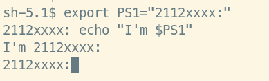

# Lab 01: A Gentle Introduction to Hadoop

## Setting up Single-node Hadoop Cluster

## Introduction to MapReduce


## Running a warm-up problem: Word Count

## Bonus

Insert table example:

Server IP Address | Ports Open
------------------|----------------------------------------
192.168.1.1       | **TCP**: 21,22,25,80,443
192.168.1.2       | **TCP**: 22,55,90,8080,80
192.168.1.3       | **TCP**: 1433,3389\
**UDP**: 1434,161

Code example:

```python
print("Hello")
```

```bash
cat ~/.bashrc
```

Screenshot example:



\newpage

Screenshot example:


Reference examples:

Some text in which I cite an author.[^fn1]

More text. Another citation.[^fn2]

What is this? Yet _another_ citation?[^fn3]


## References
<!-- References without citing, this will be display as resources -->
- Three Cloudera version of WordCount problem:
    - https://docs.cloudera.com/documentation/other/tutorial/CDH5/topics-/ht_wordcount1.html
    - https://docs.cloudera.com/documentation/other/tutorial/CDH5/topics/ht_wordcount2.html
    - https://docs.cloudera.com/documentation/other/tutorial/CDH5/topics/ht_wordcount3.html
- Book: MapReduce Design Patterns [Donald Miner, Adam Shook, 2012]
- All of StackOverflow link related.

<!-- References with citing, this will be display as footnotes -->
[^fn1]: So Chris Krycho, "Not Exactly a Millennium," chriskrycho.com, July 2015, http://v4.chriskrycho.com/2015/not-exactly-a-millennium.html
(accessed July 25, 2015)

[^fn2]: Contra Krycho, 15, who has everything _quite_ wrong.

[^fn3]: ibid